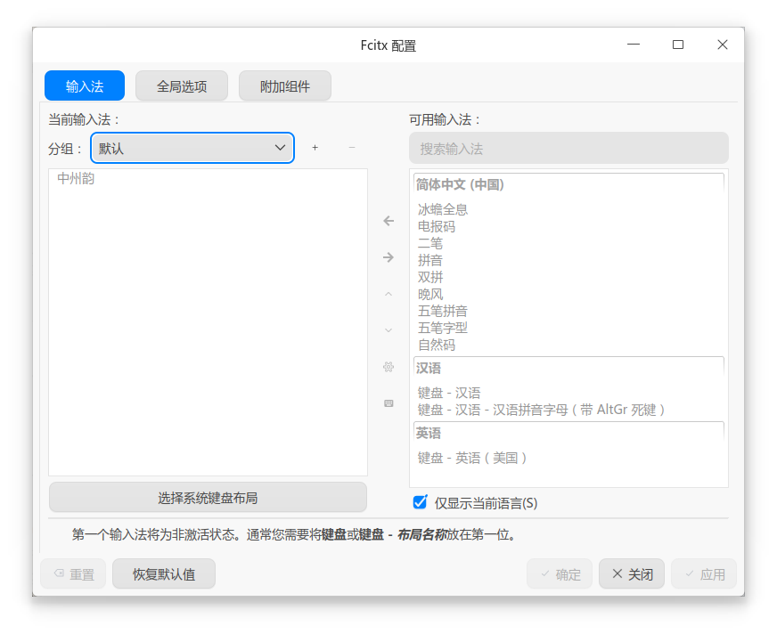

# Linux 通用部署指引 (Fcitx5)

在 Linux 平台上，Rime 通常作为 **Fcitx5** 的输入法插件运行，对应的插件名称为 **中州韵（Rime）**。部署万象前，需要先安装 Fcitx5、Rime 以及 Lua、Octagram 等相关依赖，并注意避免 Fcitx5 自身快捷键与万象按键配置发生冲突。

---

### 1. 安装核心依赖环境

根据使用的 Linux 发行版，选择对应的安装方式。

#### 发行版 A：Ubuntu / Debian 等 APT 系（手动部署）

打开终端，安装 Fcitx5、Rime 插件以及 Lua、Octagram 等相关依赖：

```bash
sudo apt install fcitx5-rime fcitx5 librime-plugin-lua librime1 librime-bin librime-plugin-octagram
```

*注：安装完成后，请继续执行第 2 步，下载并手动部署万象方案。*

*注：Debian 系列发行版的软件包版本可能相对较旧。Debian 12、Ubuntu 24.04 及以上版本通常更适合直接使用相关 librime Lua 插件；更早版本如遇依赖缺失或版本不兼容，需要自行确认软件源版本或采用编译安装。*

#### 发行版 B：Arch Linux（AUR / Arch Linux CN 仓库）

如果使用 Arch Linux，并已启用 **[Arch Linux CN 仓库](https://www.archlinuxcn.org/archlinux-cn-repo-and-mirror/)**，可以直接通过包管理器安装对应的万象方案，无需手动解压方案文件。

* **Base 标准版包名**：`rime-wanxiang-[拼写方案名]`（例如自然码：`rime-wanxiang-zrm`）

* **Pro 增强版包名**：`rime-wanxiang-pro-[拼写方案名]`（例如自然码：`rime-wanxiang-pro-zrm`）

```bash
# 例如安装万象自然码 Pro 版
sudo pacman -S rime-wanxiang-pro-zrm
```

*注：通过 Arch 仓库安装时，相关依赖和方案文件会由包管理器处理，可直接跳过第 2、4 步。*

---

### 2. 下载万象方案与模型（非 Arch 用户）

如果使用 APT 或其他需要手动部署的方式，请分别下载万象方案包和语法模型：

* **方案压缩包 (.zip)**：[CNB 下载](https://cnb.cool/amzxyz/rime-wanxiang/-/releases) | [GitHub 下载](https://github.com/amzxyz/rime-wanxiang/releases)

* **语法模型**：[wanxiang-lts-zh-hans.gram](https://cnb.cool/amzxyz/rime-wanxiang/-/releases/download/model/wanxiang-lts-zh-hans.gram)

!!! tip "Base 与 Pro 应该选择哪个？"
    * **Base 标准版**：适合以全拼、双拼等常规拼音输入为主的用户，配置相对简单。

    * **Pro 增强版**：在词库编码中进一步加入辅助码信息，适合需要使用辅助码筛选的用户。下载时应根据自己实际使用的辅助码类型选择对应分包。

---

### 3. Fcitx5 基础设置与快捷键冲突处理

完成软件安装后，打开系统或 Fcitx5 的 **输入法配置面板**，进行以下设置：

1. **添加中州韵**：在可用输入法列表中找到 **【中州韵】**，将其添加到当前启用的输入法列表。

2. **精简其他中文输入法**：如果主要使用万象，可以根据需要移除其他不再使用的中文输入法。通常保留【键盘-英语】与【中州韵】即可满足中英文输入和切换需求。

{ width="600" style="display: block; margin: 1rem auto; border-radius: 8px; box-shadow: 0 4px 12px rgba(97, 161, 101, 0.15);" }

!!! warning "注意清理 Fcitx5 快捷键，避免与 Rime 冲突"
    使用 Fcitx5 时，建议检查并清理不需要的全局快捷键。

    万象已经在 Rime 方案内部配置了较多按键功能。如果同一个按键同时被 Fcitx5 截获，就可能出现快捷键失效、行为异常或与预期不一致的情况。

    **原则上，能够在 Rime 内完成的按键功能，优先交由 Rime 处理，避免 Fcitx5 与 Rime 重复绑定。**

---

### 4. 手动置入方案与模型（非 Arch 用户）

打开终端或文件管理器，进入 Fcitx5 的 Rime 用户目录：

**默认路径：**

```text
~/.local/share/fcitx5/rime
```

1. **放入语法模型**：将下载好的 `wanxiang-lts-zh-hans.gram` 放入该目录。

2. **解压万象方案**：将方案压缩包解压后的**所有文件和文件夹**复制到该目录中。不要额外保留最外层压缩包目录；如果系统提示覆盖已有文件，请根据当前部署需求确认覆盖。

!!! danger "Fcitx5 的皮肤与外观由前端管理"
    Rime 在 Linux 上通过 Fcitx5 运行时，候选窗口和输入法外观主要由 Fcitx5 前端负责。

    * Rime 在其他平台使用的皮肤配置文件，例如 `weasel.yaml`、`squirrel.yaml`，不会直接控制 Fcitx5 的界面样式。

    * 候选词的横向或竖向排列，需要在 Fcitx5 的相关设置中调整。

    * 如果需要自定义 Fcitx5 主题，可按照 Fcitx5 的主题规则，将主题文件放入 `~/.local/share/fcitx5/theme` 目录。

---

### 5. 执行重新部署

完成方案和模型文件的放置后，点击系统托盘或状态栏中的 **【企鹅】/【键盘】** 图标，选择 **【重新部署】**；也可以根据桌面环境重新启动 Fcitx5。

> **首次部署可能需要一定时间**：Rime 需要编译词库、加载语法模型，并初始化 Lua 等相关组件。具体耗时与设备性能、词库规模和系统环境有关。部署完成前，建议不要反复触发重新部署。

---

### 6. 初始指令与个性化切换

部署成功后，万象默认使用以下输入方式：

* **Base 标准版**：默认开启 **全拼**。
* **Pro 增强版**：默认开启 **自然码双拼**。

!!! tip "建议执行一次方案切换指令"
    即使当前默认输入方式已经符合使用习惯，也建议通过 [斜杠指令](../slash_commands.md) 主动选择一次需要的拼音方案。

    该切换不仅涉及主方案，还会同步调整相关挂接方案中的输入类型配置。具体原理可参考 Custom Patch 相关说明。

    例如，在**任意输入框的中文输入状态下**输入 **`/zrm`**（切换自然码双拼）或 **`/flypy`**（切换小鹤双拼），完成后再通过状态栏执行一次 **【重新部署】**，使相关配置统一生效。

    --8<-- "docs/doc/slash_commands.md"

<div align="center" style="opacity: 0.5; font-size: 0.85em; margin-top: 2rem; font-style: italic;">
    <em>完成依赖安装、方案部署与按键检查后，即可在 Fcitx5 中正常使用万象。</em>
</div>
