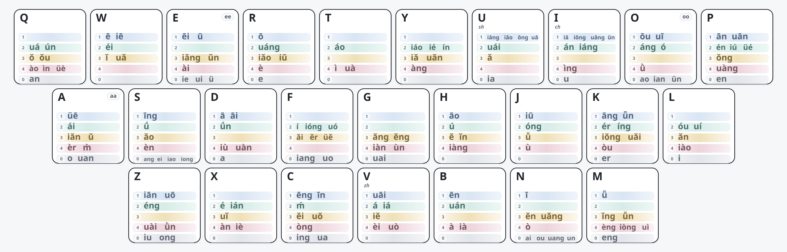

# 万象带调双拼：设计与复现

万象带调双拼的核心目标不是平均分配韵母，而是**利用声调信息离散常用二字词，优先保证高频词首选**。键位均衡和手感优化都在这一目标之后进行，虽然尽力避免，但这种模式下，要想离散的开，qpz三个按键就不能当成摆设，所以小指按z不利索的人，又喜欢标准键位的宝宝考虑清楚，而对于我们3+3的这都不是问题。

## 当前键位

`aa`、`oo`、`ee` 分别表示单韵母 `a`、`o`、`e` 的轻声特殊编码。



## 1. 核心思路

一个音节可抽象为：

```text
固定声母键 + 带调韵母键
```

同一韵母的不同声调被视为不同 token，例如 `an1`、`an2`、`an3`、`an4`。

二字词只有在两个音节位置都没有被分开时才会得到相同编码。因此，布局优化直接面向**二字词首选关系**，而不是单纯追求韵母均匀分布。

二字词也是主要优化对象：长词通常还能依靠第三、第四个字继续离散，而二字词在完整输入处重码会直接影响候选顺序。

## 2. 输入数据

复现需要两份固定输入：

| 文件 | 作用 |
| --- | --- |
| `zi.dict.yaml` | 单字及带调读音，用于补全实际存在的韵调 token，保证单字读音覆盖 |
| `jichu_v12_final.dict.yaml` | 二字目标词表，格式为 `词<TAB>带调拼音<TAB>权重`，用于首选离散、词频优先级和当前负载/手感统计 |

当前发布口径包含 **27,398 个二字读音目标**和 **169 个带调韵母 token**。

二字词权重同时承担两个作用：

1. 决定同码词的首选顺序，并参与分层优化。
2. 统计带调韵母和固定声母的使用质量，用于实体键负载与手感优化。

固定输入词表是复现条件的一部分。词条或权重发生变化后，`source-first`、竞争关系和最终冲突数量都可能改变。

## 3. 首选目标与优先级

### 3.1 Source-first

原始读音结构完全相同的一组词无法同时成为唯一首选。模型先按权重确定该读音组的 `source-first` 目标，再优化这些目标能否在最终布局中保持首选。

同一个目标即使被多个竞争词压住，也只计一次损失。

### 3.2 高频优先

| 优先级 | 目标权重 | 优化顺序 |
| ---: | ---: | --- |
| 1 | `>= 100000` | COUNT → WEIGHT |
| 2 | `30000–99999` | COUNT → WEIGHT |
| 3 | `10000–29999` | COUNT → WEIGHT |
| 4 | `4000–9999` | COUNT → WEIGHT |
| 5 | `1000–3999` | COUNT → WEIGHT |

`COUNT` 先最小化次选词数量；数量固定后，`WEIGHT` 再尽量把损失留给较低权重词。高优先级层一旦锁定，低频层不能以牺牲高频词为代价改善自身结果。

### 3.3 当前发布审计

经过求解、词频合理性复核和重新审计后，当前剩余冲突为 **510 条**：

| 权重层 | 剩余冲突 |
| ---: | ---: |
| `>= 100000` | 0 |
| `30000–99999` | 0 |
| `10000–29999` | 0 |
| `4000–9999` | 5 |
| `1000–3999` | 505 |
| **合计** | **510** |

`4000+` 当前剩余 5 个目标：`长焦`、`隔了`、`美满`、`议题`、`电竞`。

510 是最终发布词表重新审计后的结果，而不是对旧求解报告的人工删减。

## 4. 硬约束

- **一至四声分离**：同一韵母的一、二、三、四声必须落在不同按键。
- **轻声策略**：默认 `neutral_policy = free`，0 调可与同韵母其它声调共键；`distinct` 则要求轻声也分开。
- **每键容量**：`--max-per-key` 是搜索约束，不是方案理论。当前历史布局使用 `8` 作为复现参数；研究新布局时可以放宽。

## 5. 两阶段优化

### 5.1 二字词离散

第一阶段先在抽象桶中优化 token 分组，不绑定真实 QWERTY 键位，以减少键位标签造成的对称搜索。

主要步骤：

1. 建立带调 token 和声调硬约束。
2. 根据二字词竞争关系建立首选软约束。
3. 按词频层级执行 `COUNT → WEIGHT` 词典序优化。
4. 锁定已经得到的高优先级结果。

这一阶段决定**哪些带调韵母必须分开，哪些可以共桶**。

### 5.2 实体键联合细化

首选层锁定后，再把 token 分组与真实 QWERTY 键位联合优化。后续目标不能恶化已经锁定的首选层。

优化顺序为：

1. 键位使用代价。
2. 最大实体键总负载。
3. 冷键上的高频 token 质量。
4. 左右手交替。
5. 同键双击。
6. 同指移动。
7. 同手同排大跨度。
8. 总负载 L1 均衡。

因此，**二字词离散是主目标，键位手感是在主目标边界内继续优化。**

## 6. 权重与键位负载

布局不以“每键放了几个 token”衡量冷热，而按实际使用权重计算。

```text
token_mass[token] += word_weight
initial_mass[声母键] += word_weight

total_load[key]
= initial_mass[key]
+ 该键全部 token_mass
```

因此，token 数量少的键也可能很热；一个高频韵调的负载可以超过多个低频韵调之和。

键位使用代价同样按 token 使用质量加权，目标值越低越好。当前历史布局的最大实体键总负载为 `85,790,054`，总负载 CV 为 `0.3265`；左右手交替约 `54.40%`，同键双击约 `0.97%`。

## 7. 求解后的人工复核

低频语料中的专名、领域词、句法片段可能造成权重偏差，因此剩余冲突继续按真实输入行为复核：

| 类型 | 处理原则 |
| --- | --- |
| `SWAP` | 当前权重明显不符合实际使用习惯，修正权重后重新审计 |
| `PASS` | 次选词通常会继续输入第三、第四字，可依靠长词自然离散 |
| `LAYOUT` | 两边都是常见完整二字词，优先考虑重新离散 token |
| `REVIEW` | 受行业、地域或语料来源影响明显，保留人工判断 |

人工复核用于校正语料权重与真实输入行为，修改后仍必须重新运行完整审计。

## 8. 复现

### 8.1 环境

```bash
python -m pip install "ortools>=9.10,<10"
```

### 8.2 文件

```text
V12_tone_layout_optimizer.py
zi.dict.yaml
jichu_v12_final.dict.yaml
tone_final_to_key.tsv
wx_keyboard_layout.svg
```

### 8.3 重新求解

```bash
python V12_tone_layout_optimizer.py \
  --zi zi.dict.yaml \
  --jichu jichu_v12_final.dict.yaml \
  --out V12_balanced_global \
  --max-per-key 8 \
  --neutral-policy free \
  --tie-policy allow \
  --priority-mode lexicographic \
  --tier-thresholds 100000,30000,10000,4000,1000,0 \
  --workers 8
```

`--max-per-key 8` 用于复现这一版历史求解条件，并非固定理论限制。

### 8.4 只检查输入矩阵

```bash
python V12_tone_layout_optimizer.py \
  --zi zi.dict.yaml \
  --jichu jichu_v12_final.dict.yaml \
  --matrix-only \
  --out V12_matrix_check
```

固定输入首先应核对：

```text
目标数      27,398
token 数    169
tone edges  202
```

## 9. 可复现性的含义

**方法复现**：固定脚本、单字表、最终二字词表和参数后，可以重建相同的优化问题和审计逻辑。

**布局复现**：CP-SAT 包含限时、多线程阶段，部分阶段状态为 `FEASIBLE`，重新求解可能得到质量相同或接近、但逐键不同的布局。需要精确复现当前发布键位时，以 `tone_final_to_key.tsv` 为版本快照。

`FEASIBLE` 表示已找到满足约束的可行解，但未证明最优；`UNKNOWN` 也不能解释为目标不可实现。

## 10. 主要输出

| 文件 | 作用 |
| --- | --- |
| `tone_final_to_key.tsv` | token 的最终按键、显示形式和使用质量 |
| `wanxiang_tone_layout.yaml` | 按键到 token 的完整布局 |
| `wanxiang_tone_algebra.clean.yaml` | 可部署的 Rime algebra |
| `source_first_global_audit.tsv` | 全部目标的最终首选审计 |
| `unresolved_review.tsv` | 剩余次选目标及实际压位词 |
| `bucket_load_summary.tsv` | 声母、韵调和实体键总负载 |
| `handfeel_summary.tsv` | 左右手、双击、同指、跨度和键位代价 |
| `v12_solver_summary.json` | 优化阶段、证明状态和最终指标 |
